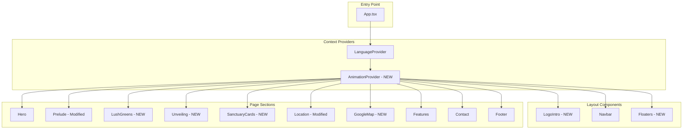
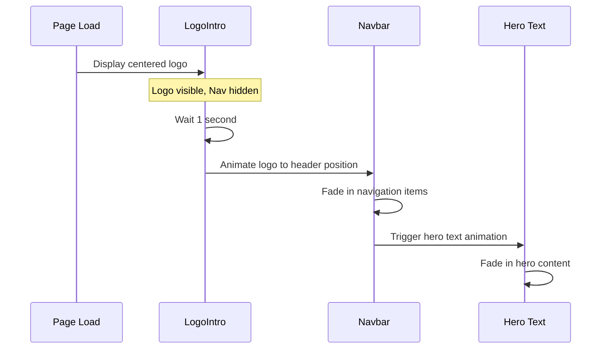

# Design Document: Superior Residence Website Revamp

## Overview

This design document outlines the technical architecture and implementation approach for transforming the existing Anyara Hills property website into Superior Residence. The revamp involves significant UI/UX changes including animated logo introduction, restructured navigation, new content sections with animations, floating action buttons, and removal of certain sections.

The website is built with React, TypeScript, Tailwind CSS, and Vite. The existing component-based architecture will be extended and modified to accommodate the new requirements.

## Architecture

### High-Level Architecture



### Animation Flow



## Components and Interfaces

### New Components

#### 1. LogoIntro Component
```typescript
interface LogoIntroProps {
  onAnimationComplete: () => void;
}

// Manages the initial logo animation sequence
// - Displays centered logo on mount
// - After 1s, animates logo to header position
// - Calls onAnimationComplete when done
```

#### 2. AnimationContext
```typescript
interface AnimationState {
  introComplete: boolean;
  logoInHeader: boolean;
  showNavItems: boolean;
  showHeroText: boolean;
}

interface AnimationContextType {
  state: AnimationState;
  setIntroComplete: () => void;
  setLogoInHeader: () => void;
  setShowNavItems: () => void;
  setShowHeroText: () => void;
}
```

#### 3. Floaters Component
```typescript
interface FloatersProps {
  whatsappNumber: string;
  formSectionId: string;
}

// Fixed position buttons at bottom-right
// - Form registration button (scrolls to contact form)
// - WhatsApp button (opens WhatsApp link)
```

#### 4. LushGreens Component
```typescript
interface LushGreensProps {
  videoSrc?: string;
  fallbackImage: string;
  overlayText: string;
}

// Full-screen video section with text overlay
// - Uses video if available, falls back to image
// - Loops video without controls
```

#### 5. Unveiling Component
```typescript
interface UnveilingProps {
  backgroundImage: string;
}

// Full-screen animated reveal section
// - Sequential fade-in: "UNVEILING" → line → logo → "Superior Residence"
// - Triggered on scroll into view
```

#### 6. SanctuaryCards Component
```typescript
interface CardData {
  id: string;
  title: string;
  image: string;
  description: string;
}

interface SanctuaryCardsProps {
  heading: string;
  cards: CardData[];
}

// Three hoverable cards with reveal animation
// - Default state: shows title only
// - Hover state: reveals image and description
```

#### 7. GoogleMapEmbed Component
```typescript
interface GoogleMapEmbedProps {
  heading: string;
  location: string;
  embedUrl: string;
}

// Embedded Google Map section
```

### Modified Components

#### Navbar (Modified)
- New navigation items: Home | Prelude | Floor Plan | Site Plan | Location | Register | EN/中
- Logo text changed to "Superior Residence"
- Visibility controlled by AnimationContext
- Logo position animated from center to header

#### Hero (Modified)
- New text content: "A sanctuary of heart and homes." + "Freehold Landed Homes"
- Animation triggered after logo animation completes
- Controlled by AnimationContext

#### Prelude/Concept (Modified)
- New layout: 40% text left, 60% video/image right
- Updated content with new philosophy text
- Clear section boundaries
- Video placeholder support

#### Location (Modified)
- New heading: "Nestled in Ayer Hitam, where comfort meets convenience."
- New background image
- Removed old location points

#### Contact (Modified)
- Updated branding to Superior Residence
- Form remains functional

#### Footer (Modified)
- Updated branding and contact information

### Removed Components
- LifestyleHub
- Gallery
- Services
- LocationMap (replaced with new Location and GoogleMapEmbed)

## Data Models

### Translation Keys (Updated)
```typescript
interface Translations {
  // Navigation
  nav_home: string;
  nav_prelude: string;
  nav_floorplan: string;
  nav_siteplan: string;
  nav_location: string;
  nav_register: string;
  
  // Hero
  hero_title: string;
  hero_subtitle: string;
  
  // Prelude
  prelude_title: string;
  prelude_text: string;
  
  // Lush Greens
  lushgreens_text: string;
  
  // Unveiling
  unveiling_text: string;
  unveiling_brand: string;
  
  // Sanctuary Cards
  sanctuary_heading: string;
  card_family_title: string;
  card_family_desc: string;
  card_heritage_title: string;
  card_heritage_desc: string;
  card_prosperity_title: string;
  card_prosperity_desc: string;
  
  // Location
  location_heading: string;
  
  // Map
  map_heading: string;
  
  // Contact & Footer
  // ... existing keys updated for Superior Residence
}
```

### Card Data Structure
```typescript
const SANCTUARY_CARDS: CardData[] = [
  {
    id: 'family',
    title: 'Family Haven',
    image: '/images/Card1.png',
    description: 'Every space at Superior Residences is designed to nurture connection...'
  },
  {
    id: 'heritage',
    title: 'Heritage Crafted',
    image: '/images/Card2.png',
    description: 'Superior Residence is a place where roots run deep...'
  },
  {
    id: 'prosperity',
    title: 'Prosperous Living',
    image: '/images/Card3.png',
    description: 'True prosperity flows from balance...'
  }
];
```

## Correctness Properties

*A property is a characteristic or behavior that should hold true across all valid executions of a system-essentially, a formal statement about what the system should do. Properties serve as the bridge between human-readable specifications and machine-verifiable correctness guarantees.*

Based on the prework analysis, most acceptance criteria are example-based tests for specific UI states and content. The following properties can be verified:

### Property 1: Language Toggle Consistency
*For any* language toggle action, switching from one language to another and back SHALL restore all text content to its original state.
**Validates: Requirements 2.3**

### Property 2: Floater Visibility During Scroll
*For any* scroll position on the page, the two floating action buttons SHALL remain visible and fixed at the bottom-right corner.
**Validates: Requirements 4.1**

### Property 3: Brand Name Consistency
*For any* rendered text content on the website, the old brand name "Anyara Hills" SHALL NOT appear; only "Superior Residence" SHALL be displayed.
**Validates: Requirements 12.1**

### Property 4: Removed Sections Absence
*For any* page render, the Lifestyle Hub, Gallery, and Services sections SHALL NOT be present in the DOM.
**Validates: Requirements 11.1, 11.2, 14.1**

## Error Handling

### Video Loading Fallback
- If video file (lushgreens.mp4) is not available, display fallback image
- Use `onError` event handler on video element to trigger fallback

### Animation Timeout Safety
- If logo animation fails to complete, force transition after 3 seconds
- Use cleanup functions in useEffect to prevent memory leaks

### Google Maps Embed Error
- Display placeholder message if iframe fails to load
- Provide fallback static map image option

### Image Loading
- Use lazy loading for images below the fold
- Provide placeholder/skeleton states during load

## Testing Strategy

### Dual Testing Approach

This project will use both unit tests and property-based tests to ensure comprehensive coverage.

#### Unit Testing
- Framework: Vitest with React Testing Library
- Focus areas:
  - Component rendering with correct content
  - Animation state transitions
  - User interactions (clicks, hovers)
  - Responsive behavior
  - Language switching

#### Property-Based Testing
- Framework: fast-check with Vitest
- Minimum iterations: 100 per property test
- Focus areas:
  - Language toggle round-trip consistency
  - Floater visibility across scroll positions
  - Brand name absence verification
  - Section removal verification

#### Test File Structure
```
__tests__/
  components/
    LogoIntro.test.tsx
    Navbar.test.tsx
    Floaters.test.tsx
    SanctuaryCards.test.tsx
    Unveiling.test.tsx
  properties/
    language.property.test.ts
    floaters.property.test.ts
    branding.property.test.ts
    sections.property.test.ts
```

#### Property Test Annotations
Each property-based test MUST include a comment in this format:
```typescript
// **Feature: superior-residence-revamp, Property 1: Language Toggle Consistency**
```

### Integration Testing
- Test animation sequence flow
- Test navigation scroll behavior
- Test form submission flow
